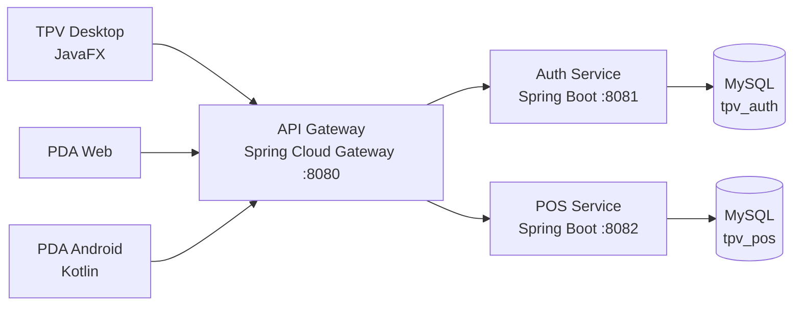

# Barix TPV


Sistema TPV para hostelería desarrollado con **Java 21, Spring Boot, APIs REST, JWT, MySQL, JavaFX y Android/Kotlin**.

El proyecto nació para resolver una necesidad real de un negocio familiar: centralizar la operativa de sala, comandas, cobros y caja, conectando un puesto Desktop con dispositivos PDA.

> **Estado:** proyecto funcional en evolución. La operativa principal está implementada y el repositorio incluye pruebas, automatizaciones y documentación de instalación y soporte.

## Qué resuelve

- Gestión de salones y mesas.
- Apertura y edición de tickets.
- Envío de comandas a barra, cocina y postres.
- Cobros totales, parciales y por líneas.
- Apertura, incidencias y cierre de caja.
- Facturación, historial y auditoría.
- Gestión de usuarios y permisos por roles.
- Operativa desde Desktop, PDA web y PDA Android.

## Aspectos técnicos destacados

- **API Gateway** como punto único de entrada para los clientes.
- Autenticación con **JWT** y autorización por roles.
- Separación entre autenticación y dominio TPV.
- Locks de mesa y heartbeat para evitar ediciones simultáneas.
- Idempotencia en operaciones críticas como comandas y cobros.
- Respuestas `409 Conflict` ante carreras o estados incompatibles.
- Trazabilidad por terminal mediante headers de contexto.
- Reglas específicas según el tipo de cliente.
- Scripts de smoke test, backup y restauración.

## Arquitectura



El Gateway enruta las peticiones a los servicios de autenticación y operativa. Los clientes nunca acceden directamente a esos servicios.

## Stack

| Área | Tecnologías |
|---|---|
| Backend | Java 21, Spring Boot 3.5, Spring Web, Spring Data JPA |
| Seguridad | Spring Security, JWT, autorización por roles |
| Integración | APIs REST, Spring Cloud Gateway, JSON |
| Persistencia | MySQL 8, Hibernate/JPA |
| Desktop | JavaFX |
| Mobile | Kotlin, Android |
| Entorno local | Docker Compose, Maven Wrapper, PowerShell |
| Calidad | JUnit, Mockito, pruebas de controlador, seguridad y concurrencia |
| Automatización | GitHub Actions, smoke tests E2E, backup y restore |

## Calidad y pruebas

El repositorio contiene **27 archivos de pruebas y 101 métodos `@Test`**.

La suite cubre, entre otros:

- reglas de tickets, pagos, comandas y caja;
- autorización y restricciones por rol;
- idempotencia de operaciones críticas;
- conflictos de concurrencia;
- controladores y contexto de Spring;
- ViewModels y servicios del cliente Desktop;
- políticas de navegación de la PDA Android.

Smoke test E2E de la PDA:

```powershell
powershell -ExecutionPolicy Bypass -File .\scripts\pda-e2e-smoke.ps1
```

Smoke test de backup y restauración:

```powershell
powershell -ExecutionPolicy Bypass -File .\scripts\db-backup-restore-smoke.ps1 -Mode auto -RootPassword root
```

## Puesta en marcha local

### Requisitos

- JDK 21.
- Docker Desktop.
- PowerShell.
- Git.
- Android Studio solo para modificar la PDA Android.

### 1. Levantar MySQL

```powershell
cd docker
docker compose up -d mysql
```

### 2. Levantar los servicios

En tres terminales:

```powershell
cd services/auth-service
.\mvnw.cmd spring-boot:run
```

```powershell
cd services/pos-service
.\mvnw.cmd spring-boot:run
```

```powershell
cd gateway
.\mvnw.cmd spring-boot:run
```

### 3. Comprobar el sistema

- PDA web: `http://localhost:8080/pda`
- Health POS: `http://localhost:8080/api/v1/pos/health`

Credenciales de demostración local:

- Usuario: `admin`
- Contraseña: `admin123`

> Estas credenciales y los valores por defecto del repositorio son exclusivamente para desarrollo local. En un despliegue se deben definir `DB_PASSWORD`, `JWT_SECRET` y las credenciales iniciales mediante variables de entorno.

### 4. Levantar el cliente Desktop

```powershell
cd tpv-desktop
.\mvnw.cmd -Dtpv.mode=real -Dtpv.auto.login=false javafx:run
```

### 5. Levantar la PDA Android

```powershell
powershell -ExecutionPolicy Bypass -File .\start-pda-android.ps1 -Install
```

## Flujo rápido de prueba

1. Iniciar sesión.
2. Abrir caja.
3. Abrir una mesa.
4. Añadir productos al ticket.
5. Enviar la comanda.
6. Cobrar el ticket.
7. Cerrar caja.

## API

La API se consume a través del Gateway en `http://localhost:8080/api/v1`.

| Método | Endpoint | Función |
|---|---|---|
| `POST` | `/api/v1/auth/login` | Iniciar sesión |
| `GET` | `/api/v1/pos/salon/tables` | Consultar mesas |
| `POST` | `/api/v1/pos/tickets/{id}/send` | Enviar comanda |
| `POST` | `/api/v1/pos/tickets/{id}/payments` | Registrar cobro |
| `POST` | `/api/v1/pos/cash-sessions/open` | Abrir caja |
| `POST` | `/api/v1/pos/cash-sessions/{id}/close` | Cerrar caja |

Consulta la [guía de API](api.md) para ver el listado operativo.

## Estructura del repositorio

```text
tpv-microservices/
├── services/
│   ├── auth-service/     Autenticación, JWT, usuarios y roles
│   └── pos-service/      Dominio TPV y reglas de negocio
├── gateway/              Entrada única y hosting de la PDA web
├── tpv-desktop/          Cliente JavaFX
├── pda-android/          Cliente Android/Kotlin
├── docker/               MySQL para desarrollo
├── scripts/              Smoke tests, backup y automatizaciones
└── docs/                 Instalación, operación y soporte
```

## Documentación

- [Arquitectura](architecture.md)
- [API](api.md)
- [Funcionalidades implementadas](features.md)
- [Guía de contribución](CONTRIBUTING.md)
- [Instalación en el negocio](docs/install-bar-windows.md)
- [Backup y restauración](docs/backup-restore.md)
- [Onboarding técnico](docs/onboarding-junior.md)

## Estado y próximos pasos

Implementado:

- autenticación y roles;
- operativa de mesas, tickets y comandas;
- cobros y caja;
- facturación y auditoría;
- clientes Desktop y PDA;
- pruebas de negocio, seguridad y concurrencia;
- smoke tests y backup/restore.

Próximas mejoras:

- añadir capturas y una demo grabada;
- ejecutar toda la suite en CI;
- incorporar migraciones de base de datos versionadas;
- facilitar el arranque completo con un único comando;
- documentar una release estable.

## Autoría

Proyecto desarrollado de forma individual por **José Ángel Martínez Castillo** para resolver una necesidad real de un negocio familiar.

He trabajado en el diseño del backend, reglas de negocio, API REST, persistencia, seguridad, clientes Desktop y Android, pruebas, automatización y puesta en marcha. He utilizado documentación y herramientas de IA como apoyo al aprendizaje y a la revisión, validando y adaptando el código al funcionamiento real del sistema.

