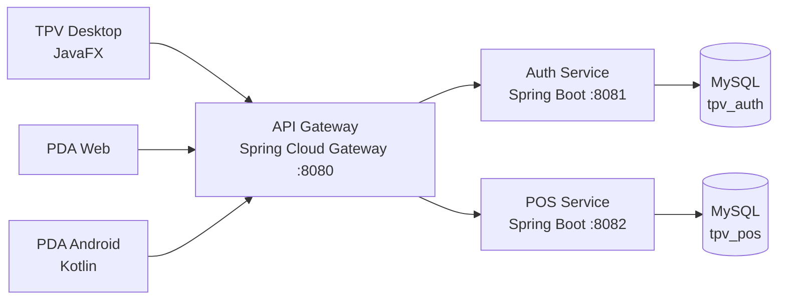

# GitHub Portfolio Presentation Implementation Plan

> **For agentic workers:** REQUIRED SUB-SKILL: Use superpowers:subagent-driven-development (recommended) or superpowers:executing-plans to implement this plan task-by-task. Steps use checkbox (`- [ ]`) syntax for tracking.

**Goal:** Transformar el perfil público y Barix en un portfolio que comunique con claridad la empleabilidad de José Ángel para puestos Java Backend/Spring Boot junior.

**Architecture:** El trabajo se divide en tres entregables independientes: presentación de Barix dentro del repositorio existente, repositorio especial del perfil `josemartcast/josemartcast` y metadatos públicos de los cuatro repositorios. No se modifica código de negocio, configuración de producción ni CI en esta fase.

**Tech Stack:** GitHub Markdown, Mermaid, Shields.io, Git, GitHub CLI y GitHub API.

## Global Constraints

- Mantener un posicionamiento honesto de desarrollador Java Backend junior.
- No afirmar experiencia profesional formal ni dominio experto.
- No publicar marcadores de capturas ni imágenes inventadas.
- No modificar código de negocio, persistencia, seguridad ni workflows.
- Mostrar únicamente badges estáticos verificables.
- Mantener Java 21, Spring Boot 3.5.9, MySQL 8 y Docker Compose como versiones demostrables.
- Publicar Barix mediante una rama y un pull request en borrador.
- Crear el repositorio de perfil público únicamente si `josemartcast/josemartcast` no existe.

---

### Task 1: Presentación de Barix

**Files:**

- Modify: `README.md`
- Reference: `architecture.md`
- Reference: `api.md`
- Reference: `features.md`
- Reference: `docs/superpowers/specs/2026-07-28-github-portfolio-presentation-design.md`

**Interfaces:**

- Consumes: estructura y funcionalidades existentes del repositorio.
- Produces: un README renderizable en GitHub y orientado a recruiter y técnico.

- [ ] **Step 1: Sustituir la introducción genérica**

Usar el título `Barix TPV` y una introducción que incluya:

```md
Sistema TPV para hostelería desarrollado con **Java 21, Spring Boot, APIs REST, JWT, MySQL, JavaFX y Android/Kotlin**.

El proyecto nació para resolver una necesidad real de un negocio familiar: centralizar la operativa de sala, comandas, cobros y caja, conectando un puesto Desktop con dispositivos PDA.
```

- [ ] **Step 2: Añadir badges verificables**

Añadir exactamente:

```md


```

No añadir badge de CI ni cobertura.

- [ ] **Step 3: Añadir valor backend y arquitectura**

Incluir las decisiones demostrables:

- API Gateway.
- JWT y permisos por roles.
- locks de mesa y heartbeat;
- idempotencia;
- conflictos `409`;
- trazabilidad por terminal;
- smoke tests y backup/restore.

Añadir este diagrama Mermaid, sin incluir `billing-service` porque actualmente no participa en el flujo descrito:

````md

````

- [ ] **Step 4: Añadir evidencia de calidad**

Incluir:

```md
El repositorio contiene **27 archivos de pruebas y 101 métodos `@Test`**.
```

Explicar que cubren reglas de negocio, seguridad, concurrencia, controladores, Desktop y Android.

- [ ] **Step 5: Mantener instrucciones ejecutables**

Conservar los comandos actuales para:

- MySQL con Docker Compose.
- `auth-service`.
- `pos-service`.
- `gateway`.
- cliente JavaFX.
- smoke E2E.
- backup/restore.

Eliminar `-DskipTests` de los ejemplos de arranque porque no aporta valor en la documentación del portfolio.

- [ ] **Step 6: Añadir seguridad, estado y autoría**

Marcar `admin/admin123` como credenciales exclusivas de desarrollo local. Añadir estado, próximos pasos y autoría individual con uso transparente de IA como apoyo.

No incluir la tabla de capturas hasta disponer de imágenes reales.

- [ ] **Step 7: Validar Markdown y afirmaciones**

Run:

```powershell
rg -n "Añadir captura|TBD|TODO|FIXME" README.md
rg -n "Java 21|Spring Boot 3.5|101 métodos|27 archivos|admin123|variables de entorno" README.md
```

Expected:

- El primer comando no devuelve coincidencias.
- El segundo devuelve todas las afirmaciones requeridas.

Comprobar que todos los enlaces locales del README apuntan a archivos existentes.

- [ ] **Step 8: Commit**

```powershell
git add README.md
git commit -m "docs: present Barix as Java backend portfolio project"
```

---

### Task 2: Perfil público de GitHub

**Files:**

- Create: `josemartcast-profile/README.md`

**Interfaces:**

- Consumes: enlaces públicos a los cuatro repositorios.
- Produces: repositorio especial público `josemartcast/josemartcast`.

- [ ] **Step 1: Comprobar si existe el repositorio**

Run:

```powershell
gh repo view josemartcast/josemartcast --json nameWithOwner,visibility,defaultBranchRef
```

Expected:

- Si existe, recuperar su estado y clonar.
- Si devuelve `GraphQL: Could not resolve`, crear el repositorio público.

- [ ] **Step 2: Crear o clonar el repositorio**

Si no existe:

```powershell
gh repo create josemartcast/josemartcast --public --description "Perfil profesional de José Ángel Martínez Castillo" --clone
```

Si existe:

```powershell
gh repo clone josemartcast/josemartcast josemartcast-profile
```

- [ ] **Step 3: Crear el README**

Crear exactamente esta estructura, sin incluir correo, teléfono ni información no proporcionada:

```md
# Hola, soy José Ángel 👋

Soy **Técnico Superior en Desarrollo de Aplicaciones Multiplataforma** y estoy orientando mi carrera hacia el **desarrollo backend con Java y Spring Boot**.

Tengo experiencia práctica creando APIs REST, reglas de negocio, persistencia SQL, autenticación con JWT, pruebas y entornos locales con Docker. Busco una oportunidad **junior** en la que pueda aportar esta base y seguir creciendo dentro de un equipo profesional.

## Proyecto destacado

### [Barix TPV](https://github.com/josemartcast/tpv-microservices)

Sistema TPV desarrollado para cubrir una necesidad real de un negocio familiar de hostelería.

- Backend con **Java 21 y Spring Boot**.
- Servicios de autenticación y operativa TPV detrás de un API Gateway.
- APIs REST, JWT y permisos por roles.
- MySQL con Docker Compose.
- Gestión de mesas, tickets, comandas, cobros, caja, facturación y auditoría.
- Control de concurrencia mediante locks, heartbeat e idempotencia.
- Cliente Desktop con JavaFX y PDA Android con Kotlin.
- Pruebas unitarias, de seguridad, integración y concurrencia.
- Automatización de smoke tests y copias de seguridad.

## Otros proyectos

- [API REST de reservas](https://github.com/josemartcast/reservas-api-spring-boot): Java 21, Spring Boot, PostgreSQL, Flyway, JUnit y Testcontainers.
- [ProFich](https://github.com/josemartcast/profich): sistema de registro horario en desarrollo con backend Spring Boot y app Android/Kotlin.
- [Agenda Restaurante](https://github.com/josemartcast/agendaRestaurante): aplicación Flutter/Firebase para gestionar reservas de hostelería.

## Tecnologías

`Java 21` · `Spring Boot` · `REST` · `Spring Data JPA` · `Spring Security` · `JUnit` · `Mockito` · `MySQL` · `PostgreSQL` · `Docker Compose` · `Git` · `Maven` · `Kotlin` · `JavaFX`

## Actualmente

- Reforzando Spring Boot, testing y buenas prácticas de backend.
- Mejorando mis proyectos para que sean más fáciles de probar y mantener.
- Buscando oportunidades de **Java Backend Junior / Spring Boot**.

📍 Jaén, España · Disponible para remoto en España y modalidad híbrida en Madrid.
```

- [ ] **Step 4: Validar enlaces y posicionamiento**

Run:

```powershell
rg -n "Java Backend|Barix TPV|reservas-api-spring-boot|profich|agendaRestaurante|Jaén|Madrid" README.md
rg -n "experto|senior|años de experiencia profesional" README.md
```

Expected:

- El primer comando devuelve todas las secciones requeridas.
- El segundo no devuelve coincidencias.

- [ ] **Step 5: Publicar el repositorio de perfil**

Para un repositorio nuevo sin rama base, crear el commit inicial:

```powershell
git add README.md
git commit -m "docs: create Java backend profile"
git push -u origin main
```

Si ya existe y tiene contenido, crear `agent/java-backend-profile`, hacer commit, push y abrir pull request en borrador.

---

### Task 3: Metadatos y orden público

**Files:**

- No repository files.
- Update through GitHub repository metadata APIs.

**Interfaces:**

- Consumes: repositorios públicos existentes.
- Produces: descripciones y topics visibles en el perfil.

- [ ] **Step 1: Actualizar Barix**

Run:

```powershell
gh repo edit josemartcast/tpv-microservices `
  --description "Barix TPV: sistema para hostelería con Java 21, Spring Boot, microservicios, REST, JWT, MySQL, JavaFX y Android/Kotlin." `
  --add-topic java `
  --add-topic spring-boot `
  --add-topic microservices `
  --add-topic rest-api `
  --add-topic mysql `
  --add-topic jwt `
  --add-topic docker-compose `
  --add-topic javafx `
  --add-topic kotlin `
  --add-topic android `
  --add-topic point-of-sale `
  --add-topic hospitality
```

- [ ] **Step 2: Actualizar API de reservas**

Run:

```powershell
gh repo edit josemartcast/reservas-api-spring-boot `
  --description "API REST de reservas con Java 21, Spring Boot, PostgreSQL, Flyway, JUnit, Testcontainers y Docker Compose." `
  --add-topic java `
  --add-topic spring-boot `
  --add-topic rest-api `
  --add-topic postgresql `
  --add-topic flyway `
  --add-topic junit5 `
  --add-topic testcontainers `
  --add-topic docker-compose
```

- [ ] **Step 3: Actualizar ProFich**

Run:

```powershell
gh repo edit josemartcast/profich `
  --description "Sistema de registro horario en desarrollo: backend Java 21/Spring Boot y app Android con Kotlin y Jetpack Compose." `
  --add-topic java `
  --add-topic spring-boot `
  --add-topic kotlin `
  --add-topic jetpack-compose `
  --add-topic android `
  --add-topic time-tracking `
  --add-topic rest-api
```

- [ ] **Step 4: Actualizar Agenda Restaurante**

Run:

```powershell
gh repo edit josemartcast/agendaRestaurante `
  --description "App Flutter/Firebase para gestionar reservas de restaurante por fecha, zona y turno." `
  --add-topic flutter `
  --add-topic dart `
  --add-topic firebase `
  --add-topic firestore `
  --add-topic restaurant `
  --add-topic reservations `
  --add-topic android
```

- [ ] **Step 5: Verificar los metadatos**

Run:

```powershell
gh repo view josemartcast/tpv-microservices --json description,repositoryTopics,url
gh repo view josemartcast/reservas-api-spring-boot --json description,repositoryTopics,url
gh repo view josemartcast/profich --json description,repositoryTopics,url
gh repo view josemartcast/agendaRestaurante --json description,repositoryTopics,url
```

Expected: cada repositorio devuelve la descripción exacta y todos sus topics.

- [ ] **Step 6: Ordenar repositorios pineados**

Orden deseado:

1. `tpv-microservices`.
2. `reservas-api-spring-boot`.
3. `profich`.
4. `agendaRestaurante`.

Usar una operación autenticada de GitHub que exponga “Customize your pins”. Si la API o sesión disponible no permite modificar los pins, informar de este único paso manual y no sustituirlo por otro cambio.

---

### Task 4: Validación y publicación de Barix

**Files:**

- Verify: `README.md`
- Verify: `docs/superpowers/specs/2026-07-28-github-portfolio-presentation-design.md`
- Verify: `docs/superpowers/plans/2026-07-28-github-portfolio-presentation.md`

**Interfaces:**

- Consumes: commits de Tasks 1-3.
- Produces: rama remota y pull request en borrador.

- [ ] **Step 1: Revisar el diff completo**

Run:

```powershell
git status -sb
git diff origin/main...HEAD -- README.md docs/superpowers
git diff --check origin/main...HEAD
```

Expected:

- Solo cambian README y documentos de diseño/plan.
- `git diff --check` termina con código 0.

- [ ] **Step 2: Verificar enlaces locales**

Extraer los enlaces relativos Markdown de `README.md` y comprobar que cada destino existe dentro del repositorio.

Expected: cero enlaces locales rotos.

- [ ] **Step 3: Verificar cifras técnicas**

Run:

```powershell
(rg -n --glob "**/src/test/**/*.{java,kt}" "@Test" | Measure-Object).Count
git rev-list --count origin/main
```

Expected:

- 101 métodos `@Test`.
- 121 commits en la base revisada.

Si la rama remota avanzó, actualizar las cifras antes de publicar.

- [ ] **Step 4: Push**

```powershell
git push -u origin agent/portfolio-presentation
```

- [ ] **Step 5: Abrir pull request en borrador**

Título:

```text
Present Barix as Java backend portfolio project
```

Cuerpo:

```md
## Qué cambia

- Reorienta el README hacia recruiters y revisores técnicos.
- Presenta Barix como proyecto real de Java Backend.
- Expone arquitectura, stack, pruebas, ejecución y estado.
- Documenta el diseño y el plan de la mejora.

## Por qué

El repositorio ya contiene una base técnica sólida, pero la portada actual funciona principalmente como onboarding interno y no comunica bien su valor como portfolio.

## Validación

- Markdown revisado sin marcadores.
- Enlaces locales comprobados.
- Stack y cifras contrastados con el repositorio.
- Sin cambios en código de negocio ni configuración.
```

- [ ] **Step 6: Verificación pública final**

Abrir:

- `https://github.com/josemartcast`
- el repositorio de perfil;
- el pull request de Barix;
- las páginas de los cuatro repositorios.

Confirmar que se ven el perfil, las descripciones y los topics. El README de Barix se validará en la vista del pull request hasta que José Ángel decida fusionarlo.
